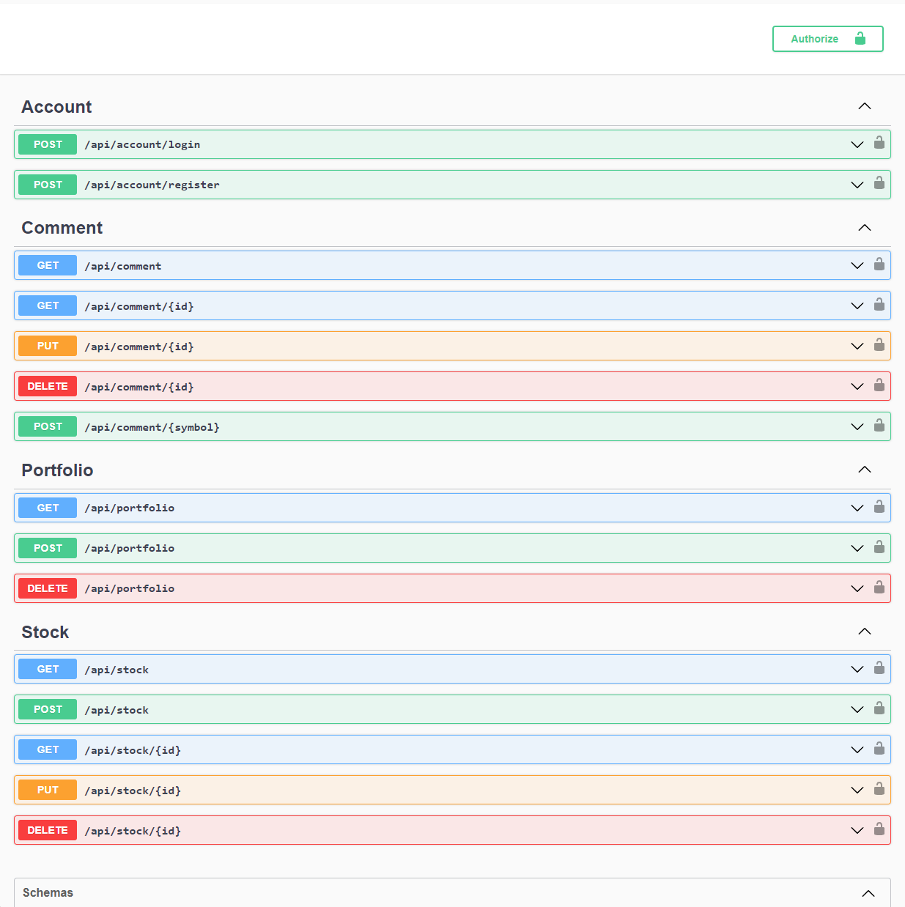

# Stock Market / Social Media Platform .NET 8 Core Web API (Backend)

Store stock equity, comments, and add stock to portfolio

## API Reference

| Parameter | Type     | Description                            |
| :-------- | :------- | :--------------------------------------|
| `id`      | `int32`  | **Required**. Id of stock to fetch     |
| `symbol`  | `int32`  | **Required**. Symbol of stock to fetch |

#### Account

```http
  POST /api/account/login
```

```http
  POST /api/account/register
```


#### Comment

```http
  GET /api/comment
```

```http
  GET /api/comment/{id}
```

```http
  PUT /api/comment/{id}
```

```http
  DELETE /api/comment/{id}
```

```http
  POST /api/comment/{symbol}
```


#### Portfolio

```http
  GET /api/portfolio
```

```http
  POST /api/portfolio
```

```http
  DELETE /api/portfolio
```

#### Stock

```http
  GET /api/stock
```

```http
  POST /api/stock/{id}
```

```http
  GET /api/stock/{id}
```

```http
  PUT /api/stock/{id}
```

```http
  DELETE /api/stock/{id}
```


## Environment Variables Setup

To run this project.

- setup your SQLServer connection string to your database (local or cloud)

- you will need to modify ConnectionStrings, FMPKey, and JWT SigningKey in ```appsettings.json```

[Get FMP API key here](https://site.financialmodelingprep.com/)

```json
{
  "ConnectionStrings": {
    "DefaultConnection": "Data Source=LOCALDB\\SQLEXPRESS;Initial Catalog=StockASPCoreWebAPIDotNet8;Integrated Security=True;Connect Timeout=30;Encrypt=False;TrustServerCertificate=False;ApplicationIntent=ReadWrite;MultiSubnetFailover=False;"
  },
  "Logging": {
    "LogLevel": {
      "Default": "Information",
      "Microsoft.AspNetCore": "Warning"
    }
  },
  "AllowedHosts": "*",
  "FMPKey": "YOUR_API_KEY",
  "Jwt": {
    "Issuer": "http://localhost:5000",
    "Audience": "http://localhost:5000",
    "SigningKey": "YOUR_SIGNING_KEY"
  }
}
```


1. Open Ternminal in your Visual Studio Code
2. Change directory to api folder 
3. Type the following command `dotnet ef migrations add Init`
4. Migrations folder is generated in the project api\Migrations
5. Type `dotnet ef database update` to update the database
6. This will create the tables in your database that you setup


## Install the follwowing packages through NuGet Gallery Visual Studio Code Extension

**EntityFrameworkCore**
- Microsoft.EntityFrameworkCore.SqlServer
- Microsoft.EntityFrameworkCore.Tools
- Microsoft.EntityFrameworkCore.Design

**ASPNETCore**
- Microsoft.AspNetCore.Identity.EntityFrameworkCore
- Microsoft.AspNetCore.Authentication.JwtBearer
- Microsoft.AspNetCore.Mvc.NewtonsoftJson
- Microsoft.AspNetCore.OpenApi

**Extensions**
- Microsoft.Extensions.Identity.Core

**Other**
- Newtonsoft.Json
- Swashbuckle.AspNetCore
    
## Run Locally

Clone the project

```bash
  git clone https://github.com/vu-a-mai/Stock-ASPNET-Core-WebAPI-DotNet8.git
```

Go to the project directory

```bash
  cd api
```


Run the project

```bash
  dotnet watch run
```


## Screenshots




## 🛠 Tools
- Visual Studio Code

- SQL Server

- SQL Server Management Studio (SSMS)

Visual Studio Code Extensions:
- C# Dev Kit
- C#
- NuGet Gallery
- .NET Install Tool 
- .NET Extension Pack


## 🔗 Links

[](https://www.linkedin.com/in/vu-anh-mai/)


